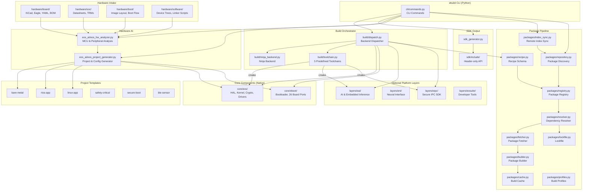

# Architecture Overview

> **Naming context:** The tool is called `ebuild` (short for "EoS Build Tool"). It is **not** related to [Gentoo's ebuild format](https://wiki.gentoo.org/wiki/Ebuild). When referring to this tool in documentation, prefer "EoS ebuild" or "EmbeddedOS Build Tool" to avoid confusion.

## System Diagram



## Subsystem Details

### CLI (`ebuild/cli/`)

The entry point for all user interaction. 18 commands implemented in `commands.py` using [Click](https://click.palletsprojects.com/). Key commands:

- `ebuild build` — orchestrate a full build from `build.yaml`
- `ebuild new` — scaffold a project from a template
- `ebuild analyze` — run the hardware analyzer on schematics
- `ebuild sdk` — generate a cross-compilation SDK
- `ebuild package` — create a versioned deliverable ZIP

At startup, the CLI loads any installed [plugins](guides/customization.md) via Python entry points (`ebuild.plugins`).

### Build Orchestrator (`ebuild/build/`)

Dispatches builds to the appropriate backend based on the project's build system:

| Backend | Used For |
|---------|----------|
| CMake | Core EoS, eBoot, EAI, ENI |
| Make | EIPC (Go components) |
| Meson | Optional modules |
| Cargo | Rust components |
| Kbuild | Linux kernel builds |
| Ninja | Custom ebuild backend |

#### Incremental correctness in the Ninja backend

The generated `cc` rule compiles with `-MMD -MF $out.d` and declares
`depfile = $out.d` / `deps = gcc`. The compiler writes out the list of headers
each object actually pulled in, and Ninja folds that list into its dependency
graph.

This matters because `build.yaml` only lists *sources*. Without a depfile Ninja
has no way to learn that `main.o` includes `mathlib.h`, so editing a header
would leave the stale object in place and the build would report success. The
depfile is what makes `ebuild build` safe to run incrementally.

The flags assume a GCC-compatible driver (`gcc`, `clang`, `arm-none-eabi-gcc`),
which is the same assumption the rest of the generated rules already make with
`-I`, `-D`, `-c` and `-o`.

The **toolchain manager** (`toolchain.py`) maintains 5 predefined cross-compilation toolchains:

- `host` — native x86_64
- `arm-none-eabi` — ARM bare-metal (Cortex-M/R)
- `aarch64-linux-gnu` — ARM64 Linux
- `riscv64-linux-gnu` — RISC-V 64
- `xtensa-esp32-elf` — ESP32

### Package Pipeline (`ebuild/packages/`)

A full dependency management system:

```
recipe.yaml → Registry → Resolver → Fetcher → Builder → Cache
                                        ↓
                                    Lockfile
```

1. **Recipe** (`recipe.py`) — YAML schema defining package name, version, URL, checksum, build system, dependencies
2. **Registry** (`registry.py`) — scans recipe directories (local, system, and cached remote) and indexes available packages
3. **Index Sync** (`index_sync.py`) — downloads, validates, and manages remote package repository indices and recipe caches (`~/.ebuild/index/`) with offline fallback
4. **Repository** (`repository.py`) — unified package discovery and multi-source search engine (`ebuild search`)
5. **Resolver** (`resolver.py`) — dependency resolution with version constraint solving
6. **Fetcher** (`fetcher.py`) — downloads and verifies source archives against SHA-256 integrity pins
7. **Builder** (`builder.py`) — builds packages using the specified build system (CMake, Make, Meson, autoconf)
8. **Cache** (`cache.py`) — caches built artifacts to avoid rebuilding
9. **Lockfile** (`lockfile.py`) — records exact resolved versions for reproducibility
10. **Profiles** (`profiles.py`) — composable build profiles (minimal, standard, full, custom)

### Hardware AI (`ebuild/eos_ai/`)

The hardware analyzer parses schematic inputs (KiCad, Eagle, YAML, BOM CSV, plain text) and produces a `HardwareProfile`:

- MCU detection via `MCU_DATABASE` (15+ MCU families)
- 24+ peripheral types detected
- Flash/RAM size and clock frequency extraction
- Generates: `board.yaml`, `boot.yaml`, `build.yaml`, `eos_product_config.h`, `eboot_flash_layout.h`, linker scripts

The **project generator** maps hardware profiles to eboot board ports, eos toolchains, and platform configurations.

### Layer System

Layers are optional components activated via `--with`:

| Layer | Directory | Build System | Notes |
|-------|-----------|--------------|-------|
| EAI | `layers/eai/` | CMake | 12 LLM models, agent loop, Ebot server |
| ENI | `layers/eni/` | CMake | Neuralink adapter, BCI framework |
| EIPC | `layers/eipc/` | Make (Go) + CMake (C SDK) | Go server + C client SDK |
| eOSuite | `layers/eosuite/` | CMake | Excluded on Windows |

### Templates

6 project templates in `templates/` use `{{PLACEHOLDER}}` variable substitution:

- `bare-metal` — minimal embedded application
- `rtos-app` — FreeRTOS/EoS RTOS application
- `linux-app` — Linux user-space application
- `safety-critical` — IEC 61508/ISO 26262 compliant (Cortex-R targets)
- `secure-boot` — secure boot chain with crypto verification
- `ble-sensor` — BLE sensor device (Nordic nRF52)
